# Akatsuki

Akatsuki is a microservices-based [osu!](https://osu.ppy.sh) private server. The services communicate via shared MySQL database, Redis pub/sub, and RabbitMQ message queues.

**Website:** [akatsuki.gg](https://akatsuki.gg)

## Service Architecture

```mermaid
flowchart TB
    subgraph External["External Clients"]
        osu(["osu! Game Client"])
        web(["Web Browser"])
        discordclient(["Discord"])
    end

    subgraph Nginx["nginx-conf (Reverse Proxy)"]
        ng{{"Rate Limiting & Routing"}}
    end

    subgraph Public["Public-Facing Services"]
        bancho["bancho-service-rs<br/>(Rust/Axum) :5001"]
        hanayo["hanayo<br/>(Go/Gin) :46221"]
        akweb["akatsuki-web<br/>(React/TypeScript) :3000"]
        api["akatsuki-api<br/>(Go/FastHTTP) :40001"]
        admin["admin-panel<br/>(PHP) :8000"]
        score["score-service<br/>(Python/FastAPI) :7000"]
    end

    subgraph Internal["Internal Services"]
        beatmaps["beatmaps-service<br/>(Python/FastAPI) :8080"]
        perf["performance-service<br/>(Rust/Axum) :8665"]
        users["users-service<br/>(Python/FastAPI) :8000"]
        assets["assets-service<br/>(Python/FastAPI) :8000"]
        payments["payments-service<br/>(Python/FastAPI) :8000"]
        history["profile-history-service<br/>(Python/FastAPI) :8000"]
    end

    subgraph Background["Background Jobs"]
        cron["new-cron<br/>(Python/asyncio)"]
        backup["sql-backup-job<br/>(Bash/Python)"]
    end

    subgraph Bots["Discord Bots"]
        aibot["ai-discord-bot<br/>(Python/discord.py)"]
        mgmtbot["management-discord-bot<br/>(Python/discord.py)"]
    end

    subgraph Data["Data Stores"]
        mysql[("MySQL<br/>Shared Database")]
        redis[("Redis<br/>Cache & Pub/Sub")]
        s3[("S3<br/>Replays & Avatars")]
        amqp[("RabbitMQ<br/>Event Queue")]
        postgres[("PostgreSQL<br/>AI Bot Data")]
    end

    subgraph ExternalAPIs["External APIs"]
        osuapi["osu! API v1/v2"]
        mirrors["Beatmap Mirrors"]
        mailgun["Mailgun"]
        discord["Discord Webhooks"]
        amplitude["Amplitude"]
        paypal["PayPal IPN"]
        openai["OpenAI/DeepSeek"]
    end

    %% Client connections
    osu --> ng
    web --> ng
    discordclient --> aibot
    discordclient --> mgmtbot

    %% Nginx routing
    ng -->|"c.akatsuki.gg"| bancho
    ng -->|"akatsuki.gg"| hanayo
    ng -->|"new.akatsuki.gg"| akweb
    ng -->|"akatsuki.gg/api/"| api
    ng -->|"old.akatsuki.gg"| admin
    ng -->|"osu.akatsuki.gg/web/"| score
    ng -->|"a.akatsuki.gg"| assets

    %% Service-to-service HTTP
    bancho -->|"beatmap lookup"| beatmaps
    bancho -->|"PP calc"| perf
    score -->|"beatmap data"| beatmaps
    score -->|"PP calc"| perf
    score -->|"match details"| bancho
    hanayo -->|"user data"| api
    hanayo -->|"match history"| bancho
    hanayo -->|"beatmaps"| beatmaps
    akweb -->|"all data"| api
    admin -->|"user mgmt"| users
    admin -->|"player data"| bancho
    perf -->|".osu files"| beatmaps
    users -->|"avatars"| assets

    %% External APIs
    beatmaps --> osuapi
    beatmaps --> mirrors
    users --> mailgun
    bancho --> discord
    score --> discord
    score --> amplitude
    hanayo --> amplitude
    payments --> paypal
    aibot --> openai
    mgmtbot --> discord

    %% Data store connections
    bancho & score & api & hanayo & admin --> mysql
    bancho & score & api & hanayo & admin --> redis
    beatmaps & perf & users --> mysql
    perf & users --> redis
    score & beatmaps & users & assets --> s3
    payments & history & cron --> mysql
    aibot --> postgres
    backup -->|"dumps"| mysql
    backup -->|"stores"| s3

    %% AMQP flows
    perf <-->|"rework queue"| amqp

    %% Redis Pub/Sub
    redis -.->|"peppy:*"| bancho
    users -.->|"peppy:ban"| redis

    %% Styling
    classDef client fill:#e1f5fe,stroke:#01579b,color:#01579b
    classDef nginx fill:#fff3e0,stroke:#e65100,color:#e65100
    classDef public fill:#e8f5e9,stroke:#2e7d32,color:#1b5e20
    classDef internal fill:#f3e5f5,stroke:#7b1fa2,color:#4a148c
    classDef data fill:#fce4ec,stroke:#c2185b,color:#880e4f
    classDef external fill:#eceff1,stroke:#546e7a,color:#37474f
    classDef background fill:#fff8e1,stroke:#f57f17,color:#f57f17
    classDef bot fill:#e3f2fd,stroke:#1565c0,color:#1565c0

    class osu,web,discordclient client
    class ng nginx
    class bancho,hanayo,akweb,api,admin,score public
    class beatmaps,perf,users,assets,payments,history internal
    class mysql,redis,s3,amqp,postgres data
    class osuapi,mirrors,mailgun,discord,amplitude,paypal,openai external
    class cron,backup background
    class aibot,mgmtbot bot
```



## Services

| Service                     | Language          | Purpose                                 |
| --------------------------- | ----------------- | --------------------------------------- |
| **nginx-conf**              | nginx             | Reverse proxy, routing, rate limiting   |
| **bancho-service-rs**       | Rust/Axum         | Real-time game server (osu! protocol)   |
| **score-service**           | Python/FastAPI    | Score submission & processing           |
| **beatmaps-service**        | Python/FastAPI    | Beatmap metadata & file distribution    |
| **performance-service**     | Rust/Axum         | PP calculation & rework management      |
| **users-service**           | Python/FastAPI    | User identity & authentication          |
| **akatsuki-api**            | Go/FastHTTP       | Public REST API                         |
| **hanayo**                  | Go/Gin            | Public website frontend                 |
| **akatsuki-web**            | React/TypeScript  | New SPA frontend (POC/experimental)     |
| **admin-panel**             | PHP               | Administrative interface                |
| **assets-service**          | Python/FastAPI    | Avatar & asset storage with moderation  |
| **payments-service**        | Python/FastAPI    | PayPal IPN & donor privilege management |
| **profile-history-service** | Python/FastAPI    | User stats history tracking             |
| **ai-discord-bot**          | Python/discord.py | AI chat bot (GPT-4/DeepSeek)            |
| **management-discord-bot**  | Python/discord.py | Scorewatch voting & player reporting    |
| **new-cron**                | Python/asyncio    | Scheduled maintenance jobs              |
| **sql-backup-job**          | Bash/Python       | MySQL backup to S3                      |
| **mysql-database**          | SQL               | Database schema & migrations            |
| **k8s-infra**               | Terraform/YAML    | Kubernetes cluster & infrastructure     |

## Communication Patterns

- **Shared Database**: All services connect to the same MySQL instance
- **Redis Pub/Sub**: Real-time events on `peppy:*` channels (ban, silence, disconnect, update_cached_stats, etc.)
- **HTTP REST**: Inter-service communication
- **AMQP**: performance-service uses message queues for background PP recalculation

### Inter-Service HTTP Calls

| Caller              | Target              | Purpose                        |
| ------------------- | ------------------- | ------------------------------ |
| bancho-service-rs   | beatmaps-service    | Beatmap metadata               |
| bancho-service-rs   | performance-service | PP calculation                 |
| score-service       | beatmaps-service    | Beatmap data                   |
| score-service       | performance-service | PP calculation                 |
| score-service       | bancho-service-rs   | Match info, chat announcements |
| hanayo              | akatsuki-api        | User data, leaderboards        |
| hanayo              | bancho-service-rs   | Match history                  |
| hanayo              | beatmaps-service    | Beatmap pages                  |
| admin-panel         | users-service       | User management                |
| admin-panel         | bancho-service-rs   | Player actions                 |
| performance-service | beatmaps-service    | .osu file download             |

### Redis Pub/Sub Channels

| Channel                     | Publishers                 | Subscribers       | Purpose                 |
| --------------------------- | -------------------------- | ----------------- | ----------------------- |
| `peppy:ban`                 | users-service, admin-panel | bancho-service-rs | Disconnect banned users |
| `peppy:unban`               | admin-panel                | bancho-service-rs | Allow reconnection      |
| `peppy:silence`             | admin-panel                | bancho-service-rs | Mute users in chat      |
| `peppy:disconnect`          | admin-panel                | bancho-service-rs | Force disconnect        |
| `peppy:notification`        | various                    | bancho-service-rs | Send notifications      |
| `peppy:change_username`     | users-service              | bancho-service-rs | Update cached name      |
| `peppy:update_cached_stats` | score-service              | bancho-service-rs | Refresh user stats      |

### AMQP Queues

| Queue          | Publisher               | Consumer                      | Purpose          |
| -------------- | ----------------------- | ----------------------------- | ---------------- |
| `rework_queue` | performance-service API | performance-service processor | PP recalculation |

## Key Architectural Patterns

### Multi-Component Services

Several services run as multiple components controlled by `APP_COMPONENT` environment variable:

**bancho-service-rs:**

- `api` - Main HTTP server handling osu! protocol
- `cleanup-cron` - Background job to clean stale sessions/streams
- `pubsub-daemon` - Listens to Redis `peppy:*` channels for events

**performance-service:**

- `api` - REST API server for PP calculation
- `processor` - AMQP consumer for rework recalculation queue
- `mass_recalc` - CLI for queuing mass recalculations
- `individual_recalc` - CLI for single-user recalculation

**profile-history-service:**

- `api` - REST API server for historical data queries
- `cron` - Background job for periodic stats snapshots

### Game Modes

Standard osu! mode enum with relax/autopilot variants:

- 0=std, 1=taiko, 2=ctb, 3=mania
- 4=std_rx, 5=taiko_rx, 6=ctb_rx (relax)
- 8=std_ap (autopilot)

### Score Submission Flow

1. Client POSTs encrypted score data to `/web/osu-submit-modular-selector.php`
2. Decrypt using Rijndael cipher
3. Validate score legitimacy
4. Calculate performance points via performance-service
5. Update user statistics in MySQL
6. Update leaderboards in Redis sorted sets
7. Check and unlock achievements
8. Handle first place announcements via bancho
9. Save replay to S3
10. Publish event to AMQP queue
11. Return response to client

### Beatmap Distribution

beatmaps-service provides beatmap metadata and files via multi-mirror architecture:

- Dynamic weighted round-robin across multiple mirrors (Mino, Nerinyan, osu!direct)
- Weights based on P75 latency + failure rate over 4-hour window
- Automatic failover with max 2 retries across mirrors
- Beatmap status freezing to prevent ranked maps from being downgraded

### PP Calculation & Reworks

performance-service supports multiple PP algorithm versions (reworks) for experimentation:

- Users can queue themselves for recalculation against different rework versions
- Separate leaderboards per rework
- Background processor handles bulk recalculations via AMQP

**PP Formula:**

```
Total PP = SUM(score.pp * 0.95^index) + bonus_pp
Bonus PP = 416.6667 * (1 - 0.995^score_count)
```

## Tech Stack

| Category           | Technologies                                                                          |
| ------------------ | ------------------------------------------------------------------------------------- |
| **Languages**      | Rust, Python, Go, TypeScript, PHP, Bash                                               |
| **Web Frameworks** | Axum, FastAPI, Gin, FastHTTP, React                                                   |
| **Databases**      | MySQL, Redis, PostgreSQL                                                              |
| **Message Queue**  | RabbitMQ (AMQP)                                                                       |
| **Storage**        | S3-compatible object storage                                                          |
| **Reverse Proxy**  | nginx                                                                                 |
| **Discord Bots**   | discord.py                                                                            |
| **External APIs**  | osu! API v1/v2, Mailgun, Discord, Amplitude, PayPal, OpenAI/DeepSeek, AWS Rekognition |

## Infrastructure

### Cloud Architecture

| Provider         | Purpose                                          |
| ---------------- | ------------------------------------------------ |
| **DigitalOcean** | Kubernetes worker nodes, nginx reverse proxy     |
| **Cloudflare**   | DNS, CDN, DDoS protection, SSL certificates      |
| **Docker Hub**   | Container registry (osuakatsuki organization)    |
| **AWS S3**       | Object storage (replays, avatars, beatmaps)      |
| **Datadog**      | APM, logs, metrics, monitoring                   |
| **Vault**        | Secrets management                               |

### Kubernetes

- **Version**: Kubernetes v1.28 (self-managed via kubeadm)
- **Container Runtime**: Docker with cri-dockerd
- **Service Mesh**: Istio (optional)
- **Workers**: 2 nodes in DigitalOcean VPC

### Reverse Proxy Architecture (Two-Layer)

Both nginx configurations run in production as a two-layer proxy:

```
Cloudflare → public-rev-proxy → k8s-rev-proxy → K8s Services
                   │
                   └──→ OVH services (direct)
```

**Layer 1: public-rev-proxy**
- Runs on mysql-master01 VM (outside K8s)
- First ingress point from Cloudflare
- Handles rate limiting at the edge
- Routes to OVH services or K8s NodePort 30000

**Layer 2: k8s-rev-proxy**
- Runs as a pod inside K8s cluster
- Entry point for traffic at NodePort 30000
- Uses K8s service DNS for internal routing

### CI/CD Pipeline

GitHub Actions → Docker Hub → Helm → Kubernetes

1. Push to main/master triggers deployment
2. Docker image built and pushed (tagged :latest and :sha)
3. Helm upgrade using common-helm-charts base
4. Atomic deployment with automatic rollback

## Code Style

| Language       | Standards                                                   |
| -------------- | ----------------------------------------------------------- |
| **Python**     | Python 3.11+, mypy strict, Black formatter, trailing commas |
| **Rust**       | cargo fmt, Clippy linting, async/await with Tokio           |
| **Go**         | gofmt, middleware-based architecture                        |
| **TypeScript** | ESLint, Prettier, strict mode, React hooks                  |
| **PHP**        | PHP 7.4+, PSR-4 autoloading                                 |
