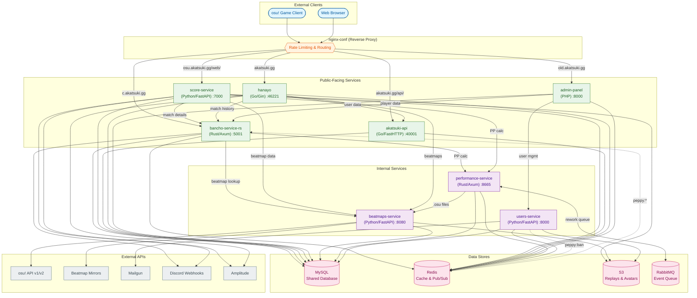

# Akatsuki

Akatsuki is a microservices-based [osu!](https://osu.ppy.sh) private server. This monorepo contains ten services that communicate via shared MySQL database, Redis pub/sub, and RabbitMQ message queues.

**Website:** [akatsuki.gg](https://akatsuki.gg)

## Service Architecture



## Services

| Service | Language | Purpose |
|---------|----------|---------|
| **nginx-conf** | nginx | Reverse proxy, routing, rate limiting |
| **bancho-service-rs** | Rust/Axum | Real-time game server (osu! protocol) |
| **score-service** | Python/FastAPI | Score submission & processing |
| **beatmaps-service** | Python/FastAPI | Beatmap metadata & file distribution |
| **performance-service** | Rust/Axum | PP calculation & rework management |
| **users-service** | Python/FastAPI | User identity & authentication |
| **akatsuki-api** | Go/FastHTTP | Public REST API |
| **hanayo** | Go/Gin | Public website frontend |
| **admin-panel** | PHP | Administrative interface |
| **mysql-database** | SQL | Database schema & migrations |

## Communication Patterns

- **Shared Database**: All services connect to the same MySQL instance
- **Redis Pub/Sub**: Real-time events on `peppy:*` channels (ban, silence, disconnect, update_cached_stats, etc.)
- **HTTP REST**: Inter-service communication
- **AMQP**: performance-service uses message queues for background PP recalculation

### Inter-Service HTTP Calls

| Caller | Target | Purpose |
|--------|--------|---------|
| bancho-service-rs | beatmaps-service | Beatmap metadata |
| bancho-service-rs | performance-service | PP calculation |
| score-service | beatmaps-service | Beatmap data |
| score-service | performance-service | PP calculation |
| score-service | bancho-service-rs | Match info, chat announcements |
| hanayo | akatsuki-api | User data, leaderboards |
| hanayo | bancho-service-rs | Match history |
| hanayo | beatmaps-service | Beatmap pages |
| admin-panel | users-service | User management |
| admin-panel | bancho-service-rs | Player actions |
| performance-service | beatmaps-service | .osu file download |

### Redis Pub/Sub Channels

| Channel | Publishers | Subscribers | Purpose |
|---------|------------|-------------|---------|
| `peppy:ban` | users-service, admin-panel | bancho-service-rs | Disconnect banned users |
| `peppy:unban` | admin-panel | bancho-service-rs | Allow reconnection |
| `peppy:silence` | admin-panel | bancho-service-rs | Mute users in chat |
| `peppy:disconnect` | admin-panel | bancho-service-rs | Force disconnect |
| `peppy:notification` | various | bancho-service-rs | Send notifications |
| `peppy:change_username` | users-service | bancho-service-rs | Update cached name |
| `peppy:update_cached_stats` | score-service | bancho-service-rs | Refresh user stats |

### AMQP Queues

| Queue | Publisher | Consumer | Purpose |
|-------|-----------|----------|---------|
| `rework_queue` | performance-service API | performance-service processor | PP recalculation |

## Key Architectural Patterns

### Multi-Component Services

Several services run as multiple components controlled by `APP_COMPONENT` environment variable:

**bancho-service-rs:**
- `api` - Main HTTP server handling osu! protocol
- `cleanup-cron` - Background job to clean stale sessions/streams
- `pubsub-daemon` - Listens to Redis `peppy:*` channels for events

**performance-service:**
- `api` - REST API server for PP calculation
- `processor` - AMQP consumer for rework recalculation queue
- `mass_recalc` - CLI for queuing mass recalculations
- `individual_recalc` - CLI for single-user recalculation

### Game Modes

Standard osu! mode enum with relax/autopilot variants:
- 0=std, 1=taiko, 2=ctb, 3=mania
- 4=std_rx, 5=taiko_rx, 6=ctb_rx (relax)
- 8=std_ap (autopilot)

### Score Submission Flow

1. Client POSTs encrypted score data to `/web/osu-submit-modular-selector.php`
2. Decrypt using Rijndael cipher
3. Validate score legitimacy
4. Calculate performance points via performance-service
5. Update user statistics in MySQL
6. Update leaderboards in Redis sorted sets
7. Check and unlock achievements
8. Handle first place announcements via bancho
9. Save replay to S3
10. Publish event to AMQP queue
11. Return response to client

### Beatmap Distribution

beatmaps-service provides beatmap metadata and files via multi-mirror architecture:
- Dynamic weighted round-robin across multiple mirrors (Mino, Nerinyan, osu!direct)
- Weights based on P75 latency + failure rate over 4-hour window
- Automatic failover with max 2 retries across mirrors
- Beatmap status freezing to prevent ranked maps from being downgraded

### PP Calculation & Reworks

performance-service supports multiple PP algorithm versions (reworks) for experimentation:
- Users can queue themselves for recalculation against different rework versions
- Separate leaderboards per rework
- Background processor handles bulk recalculations via AMQP

**PP Formula:**
```
Total PP = SUM(score.pp * 0.95^index) + bonus_pp
Bonus PP = 416.6667 * (1 - 0.995^score_count)
```

## Tech Stack

| Category | Technologies |
|----------|-------------|
| **Languages** | Rust, Python, Go, PHP |
| **Web Frameworks** | Axum, FastAPI, Gin, FastHTTP |
| **Databases** | MySQL, Redis |
| **Message Queue** | RabbitMQ (AMQP) |
| **Storage** | S3-compatible object storage |
| **Reverse Proxy** | nginx |
| **External APIs** | osu! API v1/v2, Mailgun, Discord Webhooks, Amplitude |

## Code Style

| Language | Standards |
|----------|-----------|
| **Python** | Python 3.11+, mypy strict, Black formatter, trailing commas |
| **Rust** | cargo fmt, Clippy linting, async/await with Tokio |
| **Go** | gofmt, middleware-based architecture |
| **PHP** | PHP 7.4+, PSR-4 autoloading |
